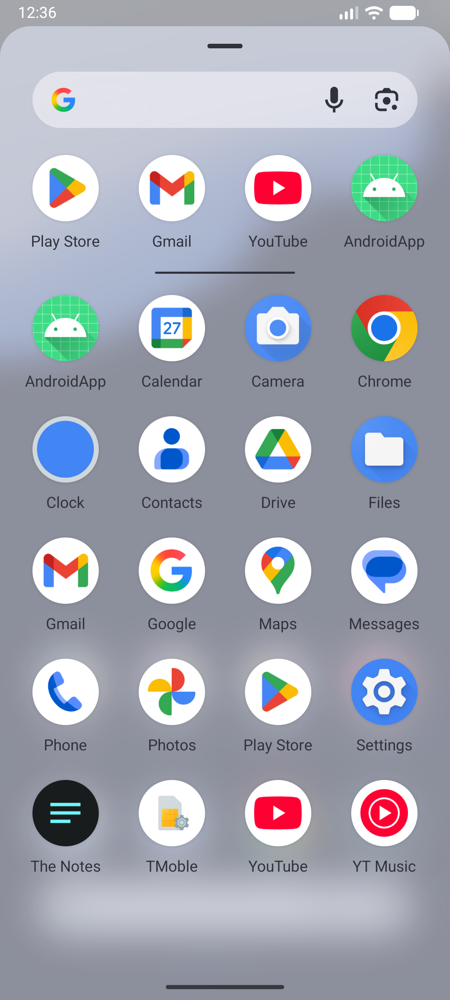
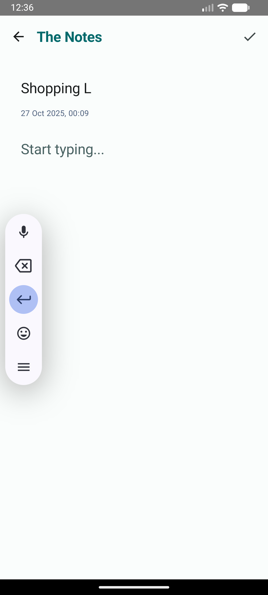
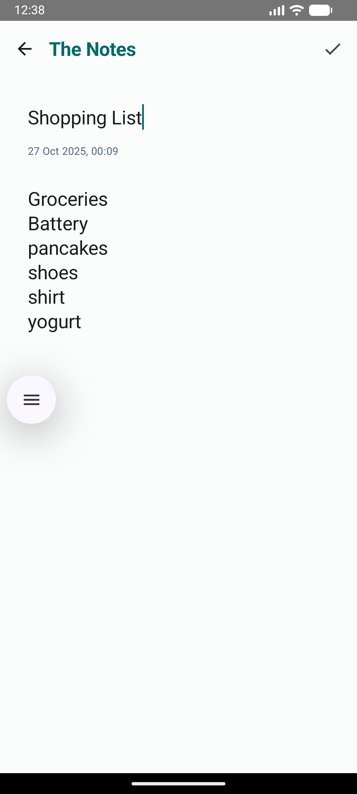
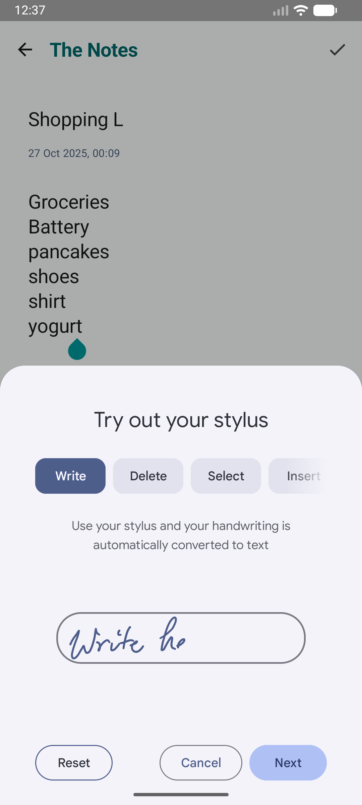
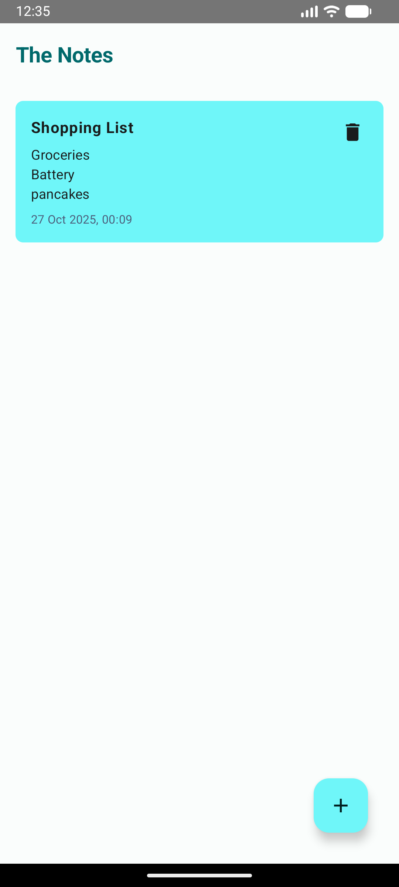

# The-Notes (Jetpack Compose Sample)

## Description

This is a simple note app build using jetpack compose and material 3. This app use Room Database to store the notes. The App build with MVVM Design Pattern and Dagger Hilt. This app let you save notes, display the notes that you have created, update the notes, and also delete the notes that you want to delete. In the future I'll add firebase so the app will be able to save the notes in the internet and can be downloaded in other smartphones. Add Github Action for CI/CD.

## Plan of Improvement

1. Cloud storage using firebase
2. Firebase Authentication (for cloud storage)
3. To Do List Notes
4. Unit Test
5. Message Encryption to ensure privacy
6. Add machine learning
7. Tablet support
8. Drawing  Notes

## How to Run
To run this project, simply clone this repository.

```
git clone https://github.com/BillyMRX1/The-Notes.git
```

Sync the gradle and build the project.
To run the app you need to use emulator or real devices.
Always checkout the main branch for the latest update.

## Screenshots

Below are a few screenshots of the app. Click any thumbnail to open the full-size image.

<div style="display:flex;flex-wrap:wrap;gap:12px;">
	<a href=".images/1.png"></a>
	<a href=".images/2.png"></a>
	<a href=".images/3.png"></a>
	<a href=".images/4.png"></a>
	<a href=".images/5.png"></a>
</div>


## Tech Stack
- [Kotlin](https://kotlinlang.org/) - Modern programming language for Android development.
- [Jetpack Compose](https://developer.android.com/jetpack/compose) - Simplified UI toolkit for native Android apps.
- [Coroutines](https://kotlinlang.org/docs/reference/coroutines-overview.html) - Official Kotlin's tooling for performing asynchronous work.
- [MVVM Architecture](https://developer.android.com/jetpack/guide) - MVVM is a design pattern for Android apps that separates UI, business logic, and data, promoting better code organization and testability.
- [Room Database](https://developer.android.com/jetpack/androidx/releases/room) - Room is an abstraction layer over SQLite, providing an easy and efficient way to work with databases in Android apps.
- [Lottie](https://airbnb.design/lottie/) - Library for adding attractive animations to apps.
- [Hilt](https://developer.android.com/jetpack/androidx/releases/hilt?hl=id) - Hilt is a dependency injection library that simplifies managing dependencies in Android apps, reducing boilerplate code and improving maintainability.
